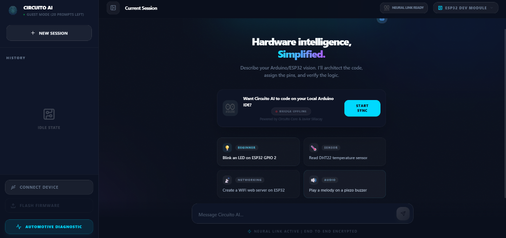
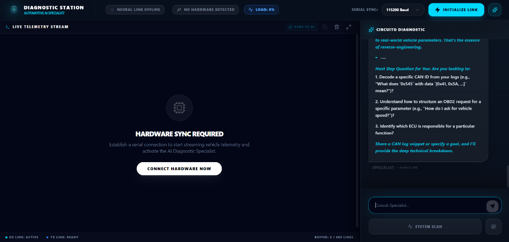

# Circuito AI

## Project Overview

Circuito AI is a professional hardware development environment designed specifically for makers, embedded engineers, IoT developers, and automotive technicians. It provides a browser-based suite of tools that eliminates the need for complex local toolchain installations, allowing users to write, debug, analyze telemetry, and flash firmware directly from their web browser.

The platform combines a powerful code editor with specialized AI assistance and direct hardware communication via the Web Serial API to create a seamless workflow for hardware prototyping and advanced vehicle diagnostics.

## Key Features

### Automotive Diagnostic Station

A dedicated environment for vehicle telemetry and hardware debugging. The Diagnostic Station connects directly to hardware to stream live sensor data at high baud rates. It features a resident **Automotive AI Specialist** that can instantly analyze live serial telemetry, identify fault codes, and offer advanced mechanical and electrical insights.

### Browser-Based Firmware Flashing (Neural Link)
Direct communication with your physical hardware using the Web Serial API. The "Neural Link" system allows you to compile and flash firmware to ESP32 and Arduino boards directly from the web interface, without any external plugins or desktop applications.

### IoT Monitoring & Live Telemetry Stream
A dedicated high-speed dashboard for managing connected devices and viewing real-time serial telemetry. It features automated scrolling, selective data copying, and intelligent "Hardware Sync" that instantly feeds physical sensor readings directly to the AI for analysis.

## Technology Stack

- **Frontend Framework**: Next.js 16 with Turbopack & React 19
- **Editor Environment**: Monaco Editor
- **Hardware Communication**: Web Serial API (Neural Link)
- **Database & Storage**: Supabase
- **Artificial Intelligence**: Advanced LLMs (Qwen/StepFun) tuned for embedded engineering and automotive diagnostics
- **Animations & UI**: Framer Motion, Tailwind CSS, and Shadcn/UI for a premium, responsive interface

## Current Development Progress

### Core Infrastructure
- Fully implemented project management system with Supabase integration.
- Intelligent Monaco Editor integration with Arduino/C++ support.
- Robust Web Serial implementation (`Neural Link`) for device detection and serial monitoring.
- Board manager system support for popular development kits (ESP32 DevKit, etc.).

### AI and Automation
- AI response streaming implemented for rapid, character-by-character delivery.
- AI Co-pilot capability to write code directly into the IDE with real-time semantic application.
- Advanced context bridging: the AI can read exact telemetry buffers and analyze hardware faults directly from the board.
- Atomic state management for seamless AI "Thinking" and loading indicators.

### User Interface and Experience
- Dark-themed IDE layout optimized for lengthy coding sessions.
- Premium UI aesthetics prioritizing glass-morphism, hardware-inspired elements, and brand consistency (Circuito AI).
- High-visibility task switching between raw Coding (IDE) and Analysis (Diagnostic Station).
- Advanced Telemetry UX: Copy-to-clipboard tools, buffer purging, and selective log highlighting.

### Recent Progress
- Deployed the unified **Diagnostic Station** and Automotive AI Specialist.
- Refined the live serial monitor to remain stable when handling continuous high-frequency data streams.
- Polished the application brand identity with ghost logos and clean minimalist avatars.
- Resolved asynchronous state race conditions in component UI interactions.

### Upcoming Milestones
- Advanced cloud compilation services for an expanded list of microcontrollers.
- Extended library management system for Arduino libraries.
- Next-generation circuit validation engine for real-time electrical physics wiring checks.

---

Built for developers who want to focus on their hardware, not their toolchain.
---
Made by: Javier G. Siliacay
